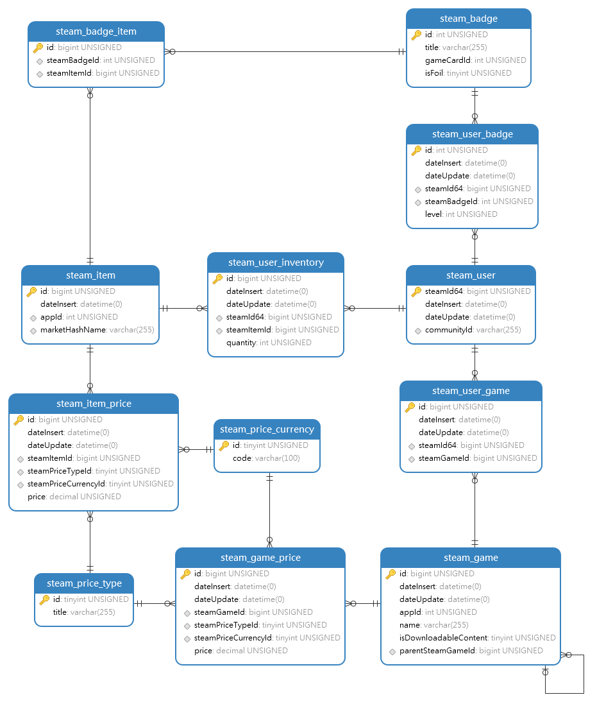

# Техническое задание для интеграцию с api steamKit.
### 1. Технические требования
* php 7.1
* mysql 5.7, использование других баз возможно после согласования
* framework yii2, использование других фреймфорков возможно после согласования
********* 
### 2. Полезные ссылки
1. [SteamKit](https://developer.valvesoftware.com/wiki/Steam_Web_API#GetGlobalAchievementPercentagesForApp_.28v0001.29)
2. [FAQ](https://developer.valvesoftware.com/wiki/Steam_Web_API/Feedback)
3. [wiki](https://wiki.teamfortress.com/wiki/Category:WebAPI)
4.  [Документация Steamworks](https://partner.steamgames.com/doc/home)
*********
### 3. Требуемый функционал - реализовать все интерфейсы для \Steam/\*.
1. \Steam\Kit интерфейсы для взаимодейстия со steam api.
2. \Steam\Models интерфейсы для сохранения полученной информации в базу.
3. Все используемые методы api steam подробно описать на русском языке, все передаваемые данные на вход и получаемые (не только те которые необходимы для заполнения текущей базы данных, а все). 
### 4. [Примеры](Example/EXAMPLE.md)    
### 5. База данных представлена в \sql\bd.sql.

